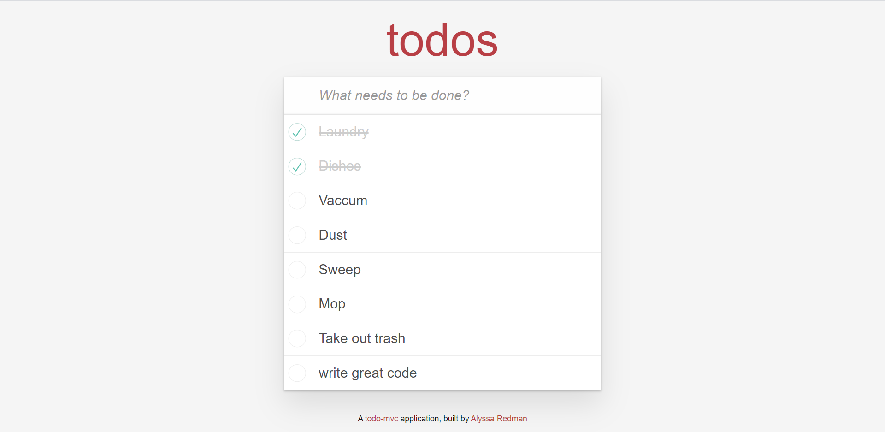

# Todo

Fluid user interface Todo app built using JavaScript.

[View the deployed application](https://todoster-alyssa-redman.herokuapp.com/)

__

### Features

* Ruby 2.5.3

* System dependencies

* Configuration

* Database creation

* Database initialization

* How to run the test suite

* Services (job queues, cache servers, search engines, etc.)

* Deployment instructions

__

### Screenshots

