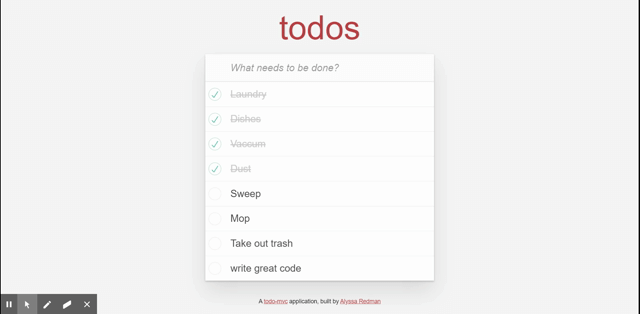

# Todo

Fluid user interface to-do single page app built using JavaScript, HTML, and CSS.

[View the deployed application](https://todoster-alyssa-redman.herokuapp.com/)

______

### Features

* Ruby 2.5.3

* PostgeSQL database

* JavaScript and jQuery allow for rapid addition of dynamic content

* RSpec and FactoryBot gems for Test Driven Developement

* Uses RESTful JSON API to fetch and update content 

* todomvc-app-css

______

### Installation

Clone with SSH `git@github.com:alyred3/todo.git` or HTTPS `https://github.com/alyred3/todo.git`.

Run `git clone git@github.com:alyred3/todo.git` or `git clone https://github.com/alyred3/todo.git` in local command line.

Run `bundle install`
______
### How to use

Type into the "What needs to be done?" field to add new items to the list. Simply click on item to check or uncheck it.

